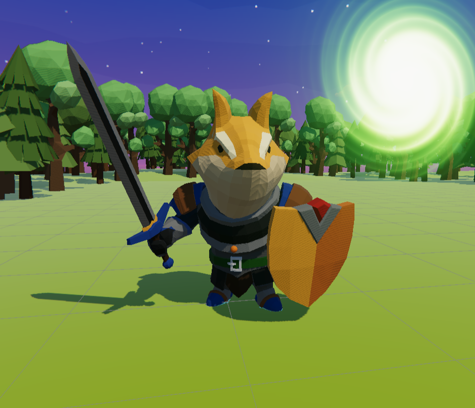

# TheKnight-RPG-URP-3D
 My first 3D RPG Game made with Unity.  
 Now become open-source to everyone !  
 (Learning from a 3D-RPG Unity Game Course of M_Studio on both BiliBili and YouTube)  

## Screenshot

## Contents
[Description](#description)
[How to contribute](#how-to-contribute)
[License](#license)

## Description 
Game engine: Unity 
Game engine version: 2020.3.48f1

This Unity project contains assets from Unity Asset Store.
Thanks to all authors and creators of them !

## How to contribute 
### Clone the repo
Use `git clone https://github.com/program-jim/TheKnight-RPG-URP-3D` command or GitHub Desktop to clone this repository
### Use Unity to open it
Use the right Unity version to open this Unity project.

## License 
Under MIT License to everyone !
